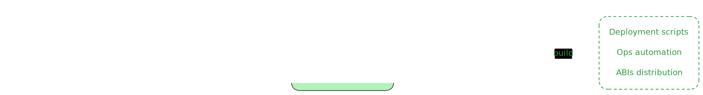
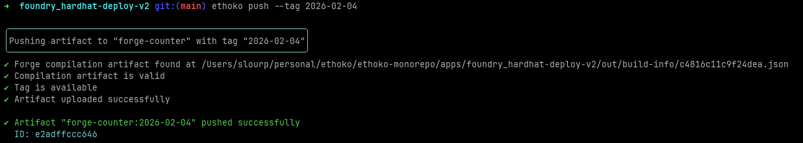
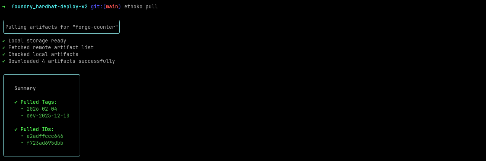
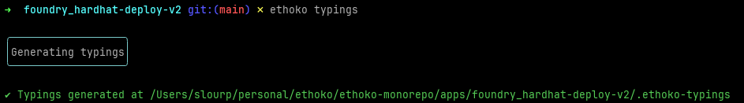
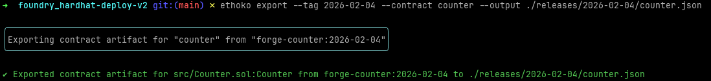

<p align="center">
    <picture>
        <source srcset="images/ethoko-logo-dark.svg" media="(prefers-color-scheme: dark)">
        <source srcset="images/ethoko-logo-light.svg" media="(prefers-color-scheme: light)">
        
    </picture>
<div>
<p align="center">
    <strong>Warehouse for smart-contract compilation artifacts.</strong>
</p>

## What is Ethoko?

Ethoko enables teams to **store** and **share** versionned smart-contract compilation artifacts.  
As such, it decouples the compilation process from the operation processes.

Define the storage backend of your choice, push your compilation artifacts to Ethoko and pull them back when you need them, in a safe and transparent way.  

Ethoko supports both Hardhat and Foundry development environments, compile once, operates safely.

<picture>
    <source srcset="images/ethoko-workflow-dark.svg" media="(prefers-color-scheme: dark)">
    <source srcset="images/ethoko-workflow-light.svg" media="(prefers-color-scheme: light)">
    
</picture>

## Hardhat Ethoko

Ethoko is for now available as a Hardhat plugin.

It supports Hardhat v3, Hardhat v2 and Foundry as development environments.

Ethoko stores compilation artifacts in your storage backend of choice, supporting AWS S3 and local filesystem storage providers.
See the [Hardhat Ethoko documentation](packages/hardhat-ethoko/README.md)
for a complete guide of the plugin, its commands, configuration options and features.

For Hardhat v2 projects, refer to the [Hardhat v2 Ethoko plugin documentation](packages/hardhat-v2-ethoko/README.md).

### Development process

Once compilation is done, push the artifacts to Ethoko under a specific tag

<picture>
  
</picture>

### Operation processes

Pull the project artifacts from Ethoko locally

<picture>
  
</picture>

<br />

In Typescript environment, generate typings for the pulled artifacts

<picture>
  
</picture>

<br />

Write scripts in a fully typed and transparent manner

```ts
...
import { project } from "../.ethoko-typings";
import { deploy } from "my-favorite-deploy-lib";

async function deployFoo() {
    // Get project utilities for the target tag
    const projectUtils = project("forge-counter").tag("2026-02-04");

    // Get `Foo` static artifact for the target release
    const myContractArtifact = await projectUtils.getContractArtifact(
      "src/Foo.sol:Foo",
    );

    // Deploy `Foo` using the static artifact
    // `deploy` is an arbitrary util, "À la Hardhat Deploy"
    await deploy("Foo@2026-02-04", {
      contract: {
        abi: myContractArtifact.abi,
        bytecode: myContractArtifact.bytecode,
        metadata: myContractArtifact.metadata,
      },
    })
}
```

Export the ABI of a specific contract for a given tag

<picture>
  
</picture>

### Complete guide and examples

Please refer to the [Hardhat Ethoko documentation](packages/hardhat-ethoko/README.md)
for a complete guide of the plugin, its commands, configuration options and features.

Integration examples with Foundry or Hardhat can be found in the `apps/` folder:

- [hardhat-v3_hardhat-deploy-v2](apps/hardhat-v3_hardhat-deploy-v2/README.md): compile a contract using Hardhat v3, deploy using Hardhat Deploy v2,
- [hardhat-v3_ignition](apps/hardhat-v3_ignition/README.md): compile a contract using Hardhat v3, deploy using Hardhat Ignition,
- [foundry_hardhat-deploy-v2](apps/foundry_hardhat-deploy-v2/README.md): compile a contract with Foundry, deploy using Hardhat Deploy v2,
- [hardhat-v2_hardhat-deploy-v0](apps/hardhat-v2_hardhat-deploy-v0/README.md): compile a contract with Hardhat v2, deploy using Hardhat Deploy v0.12,
- [hardhat-v2_hardhat-deploy-v0_external-lib](apps/hardhat-v2_hardhat-deploy-v0_external-lib/README.md): compile a contract and its external library with Hardhat v2, deploy using Hardhat Deploy v0.12.

## FAQ

### When to use Ethoko?

Use Ethoko when you want to
- decouple the compilation process from the operation processes,
- organize and version your compilation artifacts within your team(s),
- build scripts or automation on top of static compilation artifacts.

### When NOT to use Ethoko?

Don't use Ethoko when

- you are prototyping and iterating fast, Ethoko adds some friction that is not needed at this stage,
- you don't care about transparency and reproducibility of your deployments or scripts,
- you are perfectly fine with your process.

## Contributing

Thank you for your interest in contributing to Ethoko! Please see our [contributing guidelines](CONTRIBUTING.md) for more information.
