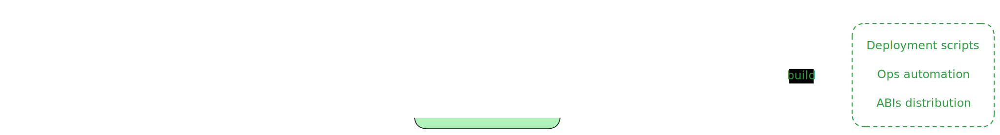
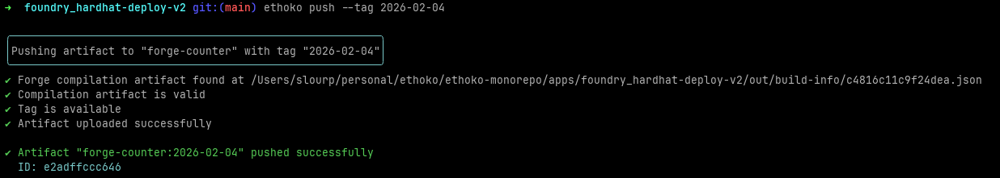
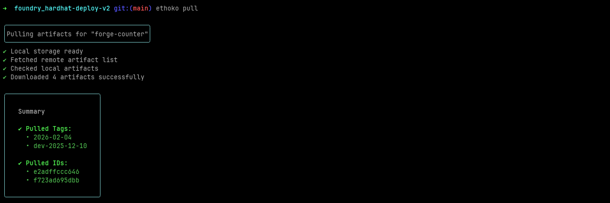
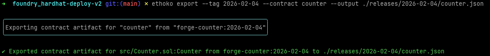
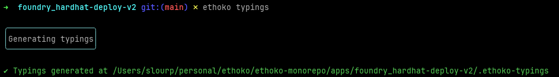

<p align="center">
    <picture>
        <source srcset="images/ethoko-logo-dark.svg" media="(prefers-color-scheme: dark)">
        <source srcset="images/ethoko-logo-light.svg" media="(prefers-color-scheme: light)">
        
    </picture>
<div>
<p align="center">
    <strong>Warehouse for smart-contract compilation artifacts.</strong>
</p>

## What is Ethoko?

Ethoko enables teams to **store** and **share** versionned smart-contract compilation artifacts.  
As such, it decouples the compilation process from the operation processes.

Define the storage backend of your choice, push your compilation artifacts to Ethoko and pull them back when you need them, in a safe and transparent way.

Ethoko supports both Hardhat and Foundry development environments, compile once, operates safely.

<picture>
    <source srcset="images/ethoko-workflow-dark.svg" media="(prefers-color-scheme: dark)">
    <source srcset="images/ethoko-workflow-light.svg" media="(prefers-color-scheme: light)">
    
</picture>

## Overview


### Development process

Once compilation is done, push the artifacts to Ethoko under a specific tag

<picture>
  
</picture>

### Operation processes

Pull the project artifacts from Ethoko locally

<picture>
  
</picture>

<br />

Export the artifact for a specific contract and tag for local use, e.g. ABI retrieving, deployment, etc...

<picture>
  
</picture>

<br />

Alternatively, if in a Typescript environment, generate typings for the pulled artifacts

<picture>
  
</picture>

<br />

Write scripts in a fully typed and transparent manner

```ts
...
import { deploy } from "my-favorite-deploy-lib";

// ~~~~~~~~~~ Using the exported artifact directly ~~~~~~~~~~
import CounterArtifact from "../releases/2026-02-04/counter.json";

async function deployCounterFromArtifact() {
    // Deploy `Counter` using the static artifact
    // `deploy` is an arbitrary util, "À la Hardhat Deploy"
    await deploy("Counter@2026-02-04", {
      contract: {
        abi: CounterArtifact.abi,
        bytecode: CounterArtifact.bytecode,
        metadata: CounterArtifact.metadata,
      },
    })
}

// ~~~~~~~~~~ Or using the generated typings ~~~~~~~~~~
import { project } from "../.ethoko-typings";

async function deployCounter() {
    // Get project utilities for the target tag
    const projectUtils = project("forge-counter").tag("2026-02-04");

    // Get `Counter` static artifact for the target release
    const myContractArtifact = await projectUtils.getContractArtifact(
      "src/Counter.sol:Counter",
    );

    // Deploy `Counter` using the static artifact
    // `deploy` is an arbitrary util, "À la Hardhat Deploy"
    await deploy("Counter@2026-02-04", {
      contract: {
        abi: myContractArtifact.abi,
        bytecode: myContractArtifact.bytecode,
        metadata: myContractArtifact.metadata,
      },
    })
}
```

## CLI

Ethoko ships as a standalone CLI.

### Install

The easiest way to install the Ethoko CLI is to through the installation script:
```bash
curl -fsSL https://raw.githubusercontent.com/VGLoic/ethoko-monorepo/main/install.sh | bash
```

Alternatively, Ethoko can be installed globally or locally via npm:
```bash
npm install -g @ethoko/cli
npm install --save-dev @ethoko/cli
```

### Configuration

Ethoko CLI can be configured through an `ethoko.json` file at the root of your project.
```json
{
  "projectName": "<my-project>",
  "compilationOutputPath": "out",
  "storage": {
    "type": "aws",
    "awsBucket": "<my-ethoko-bucket>",
    "awsRegion": "<my-aws-region>"
  }
}
```

Ethoko supports two types of storage backends for now:
- `aws`: store the compilation artifacts in an AWS S3 bucket. The bucket must be created beforehand, and the AWS credentials must be configured locally for Ethoko to be able to access it.
- `local`: store the compilation artifacts locally in the directory.

Check out the full configuration reference in the [docs](docs/developers/CONFIGURATION.md).

### Projects, tags and IDs

A unique **ID**, e.g. `b5e41181986a`, is derived for each compilation artifact. The ID is based on the content of the artifact.

A **tag**, e.g. `2026-02-02` or `v1.2.3`, can be associated to a compilation artifact when pushed.

A **project**, e.g. `doubtful-project`, will gather many compilation artifacts.

The project setup in the Hardhat Config will be used as

- target project when pushing new compilation artifacts,
- default project for pulling artifacts or other commands, different project can be specified for those commands.

### Commands

Run `ethoko --help` for a full list of available commands and options. Use the `--help` flag with any command to get more details about its usage, e.g. `ethoko push --help`.

#### Push

Push a local compilation artifact for the configured project to the storage, creating the remote artifact with its ID and optionally tagging it.

Only push the compilation artifact without an additional tag:

```bash
ethoko push
```

Or use a tag to associate the compilation artifact with it

```bash
ethoko push --tag 2026-02-02
```

If not setup in the configuration with `compilationOutputPath` or need to be overriden, the path to the compilation artifact can be provided

```bash
# e.g. ./artifacts for Hardhat, ./out for Foundry, etc...
ethoko push --artifact-path ./path/to/artifacts
```

> [!NOTE]
> Ethoko will try to read the compilation artifact from the configured or provided path. If multiple choices are possible, it will ask the user to select one of them. One can avoid this prompt by providing the full path to the compilation artifact or ensure there is only one compilation artifact in the provided path.

#### Pull

Pull locally the missing artifacts from the configured storage.

One can pull all the artifacts from the configured project

```bash
ethoko pull
```

Or target a specific artifact using its tag or ID or another project:

```bash
ethoko pull --id b5e41181986a
ethoko pull --tag 2026-02-02
ethoko pull --tag v1.2.3 --project another-project
```

#### Typings

Once the artifacts have been pulled, one can generate the TypeScript typings based on the pulled projects.

```bash
ethoko typings
```

> [!NOTE]
> If no projects have been pulled, one can still generate the default typings using this command. It may be helpful for those who do not care about the scripts involving Ethoko but want to be unblocked in case of missing files.

#### List artifacts

List the pulled compilation artifacts with their project.

```bash
ethoko artifacts
```

#### Inspect

Inspect a pulled compilation artifact to list contracts and metadata.

```bash
ethoko inspect --tag 2026-02-02
ethoko inspect --id b5e41181986a
```

Target a different project:

```bash
ethoko inspect --project another-project --tag 2026-02-02
```

Output JSON for scripting:

```bash
ethoko inspect --tag 2026-02-02 --json
```

#### Export

Export a contract artifact from a locally pulled artifact.

```bash
ethoko export --tag 2026-02-02 --contract Counter
ethoko export --id b5e41181986a --contract contracts/Counter.sol:Counter
```

Write the contract artifact to a file (overwrites if it exists):

```bash
ethoko export --tag 2026-02-02 --contract Counter --output ./Counter.json
```

Pipe the artifact to another tool:

```bash
ethoko export --tag 2026-02-02 --contract Counter | jq
```

Export the ABI as a TypeScript `const`:

```bash
echo "export const MY_ABI = $(ethoko export --tag 2026-02-02 --contract Counter | jq .abi) as const;" > ./my-abi.ts
```

#### Restore

Restore original compilation artifacts from a locally pulled artifact to a local directory.

```bash
ethoko restore --id b5e41181986a --output ./restored
ethoko restore --tag 2026-02-02 --output ./restored
ethoko restore --tag v1.2.3 --project another-project --output ./restored
```

> [!NOTE]
> The artifact must be pulled locally before restoring, and the output directory must be empty unless the `--force` flag is used.

#### Diff

Compare a local compilation artifacts with an existing compilation artifact and print the contracts for which differences have been found.

```bash
ethoko diff --tag 2026-02-02

ethoko diff --id b5e41181986a
```

If not setup in the configuration or need to be overriden, the path to the compilation artifact can be provided

```bash
# e.g. ./artifacts for Hardhat, ./out for Foundry, etc...
ethoko diff --tag 2026-02-02 --artifact-path ./path/to/artifacts
```

### Using the typings

The typings are exposed in order to help the developer retrieve easily and safely a contract artifact (ABI, bytecode, etc...).

There are two available utils in order to retrieve a contract artifact, it would depend on the task at hand:

- start with a contract, select one of its available tags

```ts
import { project } from "../.ethoko-typings";

const artifact = await project("doubtful-project")
  .contract("src/path/to/my/contract.sol:Foo")
  .getArtifact("2026-02-02");
```

- start with a tag, select a contract within it

```ts
import { project } from "../.ethoko-typings";

const artifact = await project("doubtful-project")
  .tag("2026-02-02")
  .getContractArtifact("src/path/to/my/contract.sol:Foo");
```

If typings have been generated from existing projects, the inputs of the utils will be strongly typed and wrong project, tags or contracts names will be detected.

In case there are no projects or the projects have not been pulled, the generated typings are made in such a way that strong typecheck disappears and any string can be used with the helper functions.

### Retrieve input and outputs compilation artifacts

The input and contract outputs compilation artifacts of a tag can be retrieved using the `project("doubtful-project").tag("2026-02-02").{getInputCompilationArtifact, getContractOutputCompilationArtifact}` methods.

The input compilation artifact contains the sources and settings used for compilation. There is one output compilation artifact per contract, each containing the ABI, bytecode and metadata for the contract.

#### Example with hardhat-deploy v2

An example can be made with the [hardhat-deploy](https://github.com/wighawag/hardhat-deploy) plugin for deploying a released smart contract.

The advantage of this deployment is that it only works with frozen artifacts. New development will never have an impact on it.

```ts
import { deployScript } from "../rocketh/deploy.js";
import { project } from "../.ethoko-typings";

export default deployScript(
  async ({ deploy, namedAccounts }) => {
    const { deployer } = namedAccounts;

    const fooArtifact = await project("doubtful-project")
      .tag("2026-02-04")
      .getContractArtifact("src/Foo.sol:Foo");

    await deploy(`Foo@2026-02-04`, {
      account: deployer,
      artifact: {
        abi: fooArtifact.abi,
        bytecode: fooArtifact.bytecode,
        metadata: fooArtifact.metadata,
      },
    });
  },
  { tags: ["Foo", "Foo_deploy", "2026-02-04"] },
);
```

## Integration examples

Integration examples with Foundry or Hardhat can be found in the `apps/` folder:

- [hardhat-v3_hardhat-deploy-v2](apps/hardhat-v3_hardhat-deploy-v2/README.md): compile a contract using Hardhat v3, deploy using Hardhat Deploy v2,
- [hardhat-v3_ignition](apps/hardhat-v3_ignition/README.md): compile a contract using Hardhat v3, deploy using Hardhat Ignition,
- [foundry_hardhat-deploy-v2](apps/foundry_hardhat-deploy-v2/README.md): compile a contract with Foundry, deploy using Hardhat Deploy v2,
- [hardhat-v2_hardhat-deploy-v0](apps/hardhat-v2_hardhat-deploy-v0/README.md): compile a contract with Hardhat v2, deploy using Hardhat Deploy v0.12,
- [hardhat-v2_hardhat-deploy-v0_external-lib](apps/hardhat-v2_hardhat-deploy-v0_external-lib/README.md): compile a contract and its external library with Hardhat v2, deploy using Hardhat Deploy v0.12,
- [foundry_etherscan-verification](apps/foundry_etherscan-verification/README.md): compile a contract with Foundry, deploy using Hardhat Ignition, verify on Etherscan using the static artifact,
- [hardhat-v3_etherscan-verification](apps/hardhat-v3_etherscan-verification/README.md): compile a contract with Hardhat v3, deploy using Hardhat Ignition, verify on Etherscan using the static artifact.

## FAQ

### When to use Ethoko?

Use Ethoko when you want to

- decouple the compilation process from the operation processes,
- organize and version your compilation artifacts within your team(s),
- build scripts or automation on top of static compilation artifacts.

### When NOT to use Ethoko?

Don't use Ethoko when

- you are prototyping and iterating fast, Ethoko adds some friction that is not needed at this stage,
- you don't care about transparency and reproducibility of your deployments or scripts,
- you are perfectly fine with your process.

## Contributing

Thank you for your interest in contributing to Ethoko! Please see our [contributing guidelines](CONTRIBUTING.md) for more information.
